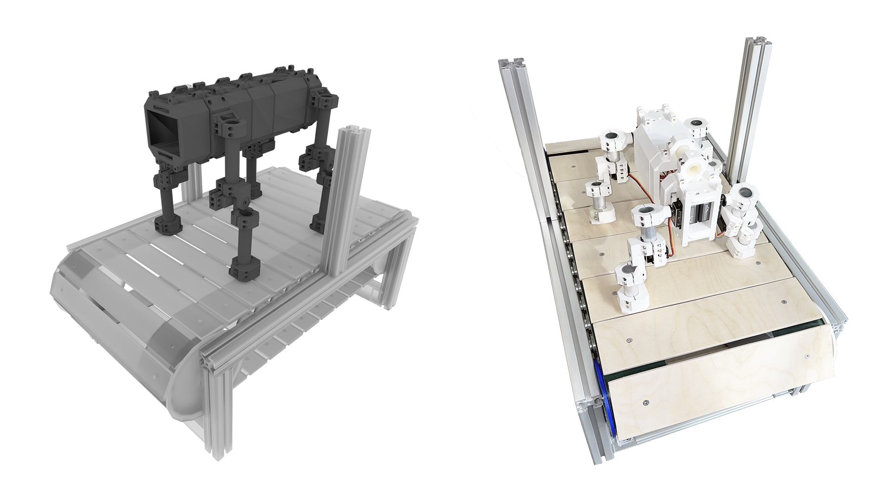

# Benchmarks for the Co-Adaptation of Robots

In this project, we created a physical benchmarking setup for the co-adaptation of walking quadruped robots. In concrete terms, this involves designing and building both a quadruped robot and a treadmill that allows for stationary benchmarking of the robot. In addition, developing software for operating the robot and interfacing with the co-adaptation algorithms was also necessary. This project repository contains CAD models for the robot and the treadmill and software for robot communication. 

Akira King - Riku Lehtonen - Tatu Saarikangas - Arundev Satheesan

    .
    ├── Communication         # Communication between different components of the co-adaptation hardware
    ├── Robot                 # Robot CAD models and documentation
    ├── Treadmill             # Treadmill CAD models, build guide and parts list
    ├── LICENSE
    ├── projectimage.png
    ├── projectvideo.gif
    └── README.md

Check out the full video:
[Creating Benchmarks for the Co-Adaptation of Robots - VIDEO](https://wiki.aalto.fi/display/AEEproject/Creating+Benchmarks+for+the+Co-Adaptation+of+Robots?preview=/212893721/212901661/coadapt_short.mp4)
